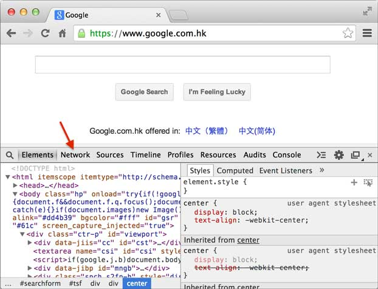
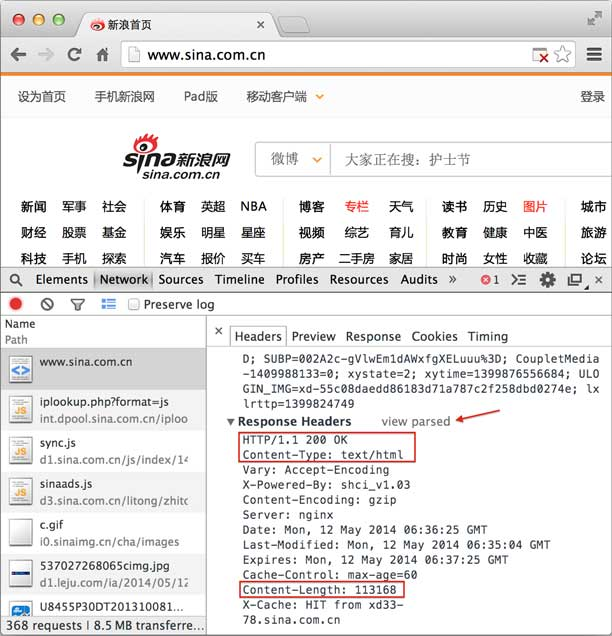

**Table of contents**

- [HTTP协议简介](#http协议简介)
- [HTML简介](#html简介)
- [WSGI接口](#wsgi接口)
- [使用Web框架](#使用web框架)
- [使用模板](#使用模板)
- [References](#references)

最早的软件都是运行在大型机上的，软件使用者通过“哑终端”登陆到大型机上去运行软件。后来随着PC机的兴起，软件开始主要运行在桌面上，而数据库这样的软件运行在服务器端，这种Client/Server模式简称CS架构。

随着互联网的兴起，人们发现，CS架构不适合Web，最大的原因是Web应用程序的修改和升级非常迅速，而CS架构需要每个客户端逐个升级桌面App，因此，Browser/Server模式开始流行，简称BS架构。

在BS架构下，客户端只需要浏览器，应用程序的逻辑和数据都存储在服务器端。浏览器只需要请求服务器，获取Web页面，并把Web页面展示给用户即可。

当然，Web页面也具有极强的交互性。由于Web页面是用HTML编写的，而HTML具备超强的表现力，并且，服务器端升级后，客户端无需任何部署就可以使用到新的版本，因此，BS架构迅速流行起来。

今天，除了重量级的软件如Office，Photoshop等，大部分软件都以Web形式提供。比如，新浪提供的新闻、博客、微博等服务，均是Web应用。

Web应用开发可以说是目前软件开发中最重要的部分。Web开发也经历了好几个阶段：

静态Web页面：由文本编辑器直接编辑并生成静态的HTML页面，如果要修改Web页面的内容，就需要再次编辑HTML源文件，早期的互联网Web页面就是静态的；

CGI：由于静态Web页面无法与用户交互，比如用户填写了一个注册表单，静态Web页面就无法处理。要处理用户发送的动态数据，出现了Common Gateway Interface，简称CGI，用C/C++编写。

ASP/JSP/PHP：由于Web应用特点是修改频繁，用C/C++这样的低级语言非常不适合Web开发，而脚本语言由于开发效率高，与HTML结合紧密，因此，迅速取代了CGI模式。ASP是微软推出的用VBScript脚本编程的Web开发技术，而JSP用Java来编写脚本，PHP本身则是开源的脚本语言。

MVC：为了解决直接用脚本语言嵌入HTML导致的可维护性差的问题，Web应用也引入了Model-View-Controller的模式，来简化Web开发。ASP发展为ASP.Net，JSP和PHP也有一大堆MVC框架。

目前，Web开发技术仍在快速发展中，异步开发、新的MVVM前端技术层出不穷。

Python的诞生历史比Web还要早，由于Python是一种解释型的脚本语言，开发效率高，所以非常适合用来做Web开发。

Python有上百种Web开发框架，有很多成熟的模板技术，选择Python开发Web应用，不但开发效率高，而且运行速度快。

本章我们会详细讨论Python Web开发技术。

## HTTP协议简介

在Web应用中，服务器把网页传给浏览器，实际上就是把网页的HTML代码发送给浏览器，让浏览器显示出来。而浏览器和服务器之间的传输协议是HTTP，所以：

- HTML是一种用来定义网页的文本，会HTML，就可以编写网页；

- HTTP是在网络上传输HTML的协议，用于浏览器和服务器的通信。

在举例子之前，我们需要安装Google的Chrome浏览器。

为什么要使用Chrome浏览器而不是IE呢？因为IE实在是太慢了，并且，IE对于开发和调试Web应用程序完全是一点用也没有。

我们需要在浏览器很方便地调试我们的Web应用，而Chrome提供了一套完整地调试工具，非常适合Web开发。

安装好Chrome浏览器后，打开Chrome，在菜单中选择“视图”，“开发者”，“开发者工具”，就可以显示开发者工具：



Elements显示网页的结构，Network显示浏览器和服务器的通信。我们点Network，确保第一个小红灯亮着，Chrome就会记录所有浏览器和服务器之间的通信：


当我们在地址栏输入www.sina.com.cn时，浏览器将显示新浪的首页。在这个过程中，浏览器都干了哪些事情呢？通过Network的记录，我们就可以知道。在Network中，定位到第一条记录，点击，右侧将显示Request Headers，点击右侧的view source，我们就可以看到浏览器发给新浪服务器的请求：


最主要的头两行分析如下，第一行：

```
GET / HTTP/1.1
```

GET表示一个读取请求，将从服务器获得网页数据，/表示URL的路径，URL总是以/开头，/就表示首页，最后的HTTP/1.1指示采用的HTTP协议版本是1.1。目前HTTP协议的版本就是1.1，但是大部分服务器也支持1.0版本，主要区别在于1.1版本允许多个HTTP请求复用一个TCP连接，以加快传输速度。

从第二行开始，每一行都类似于Xxx: abcdefg：

```
Host: www.sina.com.cn
```

表示请求的域名是www.sina.com.cn。如果一台服务器有多个网站，服务器就需要通过Host来区分浏览器请求的是哪个网站。

继续往下找到Response Headers，点击view source，显示服务器返回的原始响应数据：



HTTP响应分为Header和Body两部分（Body是可选项），我们在Network中看到的Header最重要的几行如下：

```
200 OK
```

200表示一个成功的响应，后面的OK是说明。失败的响应有404 Not Found：网页不存在，500 Internal Server Error：服务器内部出错，等等。

```
Content-Type: text/html
```

Content-Type指示响应的内容，这里是text/html表示HTML网页。请注意，浏览器就是依靠Content-Type来判断响应的内容是网页还是图片，是视频还是音乐。浏览器并不靠URL来判断响应的内容，所以，即使URL是http://example.com/abc.jpg，它也不一定就是图片。

HTTP响应的Body就是HTML源码，我们在菜单栏选择“视图”，“开发者”，“查看网页源码”就可以在浏览器中直接查看HTML源码：


当浏览器读取到新浪首页的HTML源码后，它会解析HTML，显示页面，然后，根据HTML里面的各种链接，再发送HTTP请求给新浪服务器，拿到相应的图片、视频、Flash、JavaScript脚本、CSS等各种资源，最终显示出一个完整的页面。所以我们在Network下面能看到很多额外的HTTP请求。

### HTTP请求

跟踪了新浪的首页，我们来总结一下HTTP请求的流程：

步骤1：浏览器首先向服务器发送HTTP请求，请求包括：

方法：GET还是POST，GET仅请求资源，POST会附带用户数据；

路径：/full/url/path；

域名：由Host头指定：Host: www.sina.com.cn

以及其他相关的Header；

如果是POST，那么请求还包括一个Body，包含用户数据。

步骤2：服务器向浏览器返回HTTP响应，响应包括：

响应代码：200表示成功，3xx表示重定向，4xx表示客户端发送的请求有错误，5xx表示服务器端处理时发生了错误；

响应类型：由Content-Type指定，例如：Content-Type: text/html;charset=utf-8表示响应类型是HTML文本，并且编码是UTF-8，Content-Type: image/jpeg表示响应类型是JPEG格式的图片；

以及其他相关的Header；

通常服务器的HTTP响应会携带内容，也就是有一个Body，包含响应的内容，网页的HTML源码就在Body中。

步骤3：如果浏览器还需要继续向服务器请求其他资源，比如图片，就再次发出HTTP请求，重复步骤1、2。

Web采用的HTTP协议采用了非常简单的请求-响应模式，从而大大简化了开发。当我们编写一个页面时，我们只需要在HTTP响应中把HTML发送出去，不需要考虑如何附带图片、视频等，浏览器如果需要请求图片和视频，它会发送另一个HTTP请求，因此，一个HTTP请求只处理一个资源。

HTTP协议同时具备极强的扩展性，虽然浏览器请求的是http://www.sina.com.cn/的首页，但是新浪在HTML中可以链入其他服务器的资源，比如，从而将请求压力分散到各个服务器上，并且，一个站点可以链接到其他站点，无数个站点互相链接起来，就形成了World Wide Web，简称“三达不溜”（WWW）。

### HTTP格式

每个HTTP请求和响应都遵循相同的格式，一个HTTP包含Header和Body两部分，其中Body是可选的。

HTTP协议是一种文本协议，所以，它的格式也非常简单。HTTP GET请求的格式：

```
GET /path HTTP/1.1
Header1: Value1
Header2: Value2
Header3: Value3
```

每个Header一行一个，换行符是\r\n。

HTTP POST请求的格式：

```
POST /path HTTP/1.1
Header1: Value1
Header2: Value2
Header3: Value3

body data goes here...
```

当遇到连续两个\r\n时，Header部分结束，后面的数据全部是Body。

HTTP响应的格式：

```
200 OK
Header1: Value1
Header2: Value2
Header3: Value3

body data goes here...
```

HTTP响应如果包含body，也是通过\r\n\r\n来分隔的。请再次注意，Body的数据类型由Content-Type头来确定，如果是网页，Body就是文本，如果是图片，Body就是图片的二进制数据。

当存在Content-Encoding时，Body数据是被压缩的，最常见的压缩方式是gzip，所以，看到Content-Encoding: gzip时，需要将Body数据先解压缩，才能得到真正的数据。压缩的目的在于减少Body的大小，加快网络传输。

## HTML简介

## WSGI接口

## 使用Web框架

## 使用模板

## References

1. [Web开发](https://www.liaoxuefeng.com/wiki/1016959663602400/1017804650182592)
