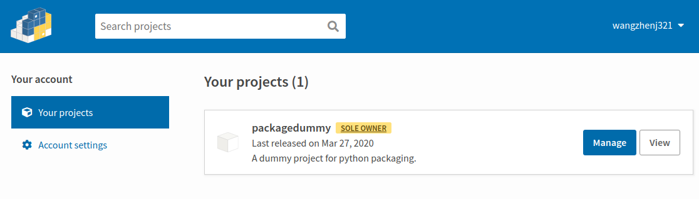

本文以名为`packagedummy`的application为例，展示如何编写一个标准的package，期间主要涉及三个步骤：

- Configure: `packagedummy`的文件和目录组织
- Package: 打包`packagedummy`
- Distribute: 把打包后的`packagedummy`发布到Pypi中

## Configure

编写`packagedummy`时，需要注意两方面的规范：

- 文件目录组织：包含目录组织规范、某些必需的文件
- `setup.py`：打包的参数信息

### 文件目录组织

```
packagedummy
├── MANIFEST.in
├── packagedummy
│   ├── __init__.py
│   └── main.py
├── README.rst
├── setup.cfg
└── setup.py
```

- `setup.py`: 最为重要的文件，包含了打包的参数和基本信息
- `setup.cfg`: `setup.py`的配置文件，其格式为`INI`
- `README.rst`: reStructuredText格式的文件，用于介绍项目
- `MANIFEST.in`: 记录某些需要被打包但未被`setup.py`包含的文件

> `MANIFEST.in`, `setup.cfg`, and `packagedummy/__init__.py` are empty.

```
$ cat README.rst                 
============
packagedummy
============

A dummy project is to test for packaging and distributing python application.
```

```
$ cat packagedummy/main.py          
def main():
    print("A dummy project for python package.")
```

### `Setup.py`

```python
import os
from setuptools import setup, find_packages

setup(
    name='packagedummy',
    version='0.0.2',
    keywords='dummy',
    description='A dummy project for python packaging.',
    long_description=open(
        os.path.join(
            os.path.dirname(__file__),
            'README.rst'
        )
    ).read(),
    author='wangzhenj321',
    author_email='wangzhenj321@gmail.com',
    url='https://github.com/wangzhenj321/packagedummy',
    packages=find_packages(),
    license='MIT'
)
```

- `name`: 项目名称
- `version`: 版本号
- `keywords`: 项目的关键字
- `description`: 项目简介
- `long_description`: 项目详细介绍
- `author`: 作者名
- `author_email`: 作者邮箱
- `url`: 项目的homepage
- `packages`: 项目包含的packages
- `license`: 如 MIT, APACHE, GNU 等

> Help of `setup.py`:
> 
> ```
> python setup.py --help
> ```

## Package

采用`pip`可安装source distribution(sdist)和wheels这两种格式python package，如果二者同时存在，`pip`优选选择wheel。

### `sdist`

```
$ python setup.py sdist
$ tree packagedummy
packagedummy
├── dist
│   └── packagedummy-0.0.2.tar.gz
├── MANIFEST.in
├── packagedummy
│   ├── __init__.py
│   └── main.py
├── packagedummy.egg-info
│   ├── dependency_links.txt
│   ├── PKG-INFO
│   ├── SOURCES.txt
│   └── top_level.txt
├── README.rst
├── setup.cfg
└── setup.py
```

### `bdist_wheel`

```
$ python setup.py bdist_wheel
$ tree packagedummy
packagedummy
├── build
│   ├── bdist.linux-x86_64
│   └── lib
│       └── packagedummy
│           ├── __init__.py
│           └── main.py
├── dist
│   └── packagedummy-0.0.2-py3-none-any.whl
├── MANIFEST.in
├── packagedummy
│   ├── __init__.py
│   └── main.py
├── packagedummy.egg-info
│   ├── dependency_links.txt
│   ├── PKG-INFO
│   ├── SOURCES.txt
│   └── top_level.txt
├── README.rst
├── setup.cfg
└── setup.py
```

## Distribute

1. 在Pypi创建一个账户

2. 创建如下配置文件`~/.pypirc`

    ```
    [distutils]
    index-servers =
        pypi
    
    [pypi]
    username: <user name>
    password: <password>
    ```

3. 安装`twine`，用于上传打包好的package至Pypi

4. 上传package: `twine upload dist/*`

5. Test

   - Own projects on Pypi:
   
       
   
   - Install own project with `pip`:
   
       ```
       pip install packagedummy
       ```

## References

1. [Python application 的打包和发布——(上)](http://wsfdl.com/python/2015/09/06/Python%E5%BA%94%E7%94%A8%E7%9A%84%E6%89%93%E5%8C%85%E5%92%8C%E5%8F%91%E5%B8%83%E4%B8%8A.html)
2. [A sample Python project](https://github.com/pypa/sampleproject)
