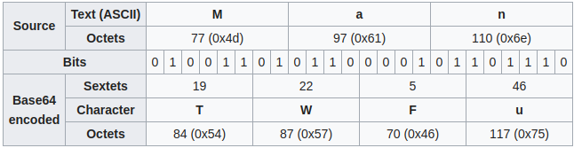
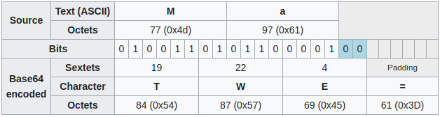
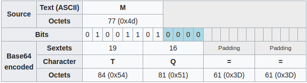

## Why Do We Need Base64?

Say you have a binary image file you wanted to transfer across a network. You’re amazed that the file wasn’t received properly on the other side—the file just contained strange characters! Well, it seems that you attempted to send your file in its raw bits and bytes format, while the media used was designed for streaming text.What would be the workaround to avoid such an issue? The answer is **Base64 encoding**.

## What Is Base64?

**Base64** is a way in which 8-bit binary data is encoded into a format that can be represented in 6 bits. This is done using only the characters `A-Z`, `a-z`, `0-9`, `+`, and `/` in order to represent data, with `=` used to pad data. For instance, using this encoding, three 8-bit bytes are converted into four 6-bit bytes.

The term **Base64** is taken from the **Multipurpose Internet Mail Extensions (MIME)** standard, which is widely used for HTTP and XML, and was originally developed for encoding email attachments for transmission.

- `b'Man'`

    ```python
    >>> b = b'Man'
    >>> base64.b64encode(b)
    b'TWFu'
    ```
    
    

- `b'Ma'`

    ```python
    >>> b = b'Ma'
    >>> base64.b64encode(b)
    b'TWE='
    ```
    
    

- `b'M'`

    ```python
    >>> b = b'M'
    >>> base64.b64encode(b)
    b'TQ=='
    ```
    
    

## `base64`

The modern interface provides:

- `base64.b64encode(s, altchars=None)` :vs: `base64.b64decode(s, altchars=None, validate=False)`
- `base64.urlsafe_b64encode(s)` :vs: `base64.urlsafe_b64decode(s)`

## References

1. [Base64 Encoding and Decoding Using Python](https://code.tutsplus.com/tutorials/base64-encoding-and-decoding-using-python--cms-25588)
2. [Base64](https://en.wikipedia.org/wiki/Base64)
3. [base64 — Base16, Base32, Base64, Base85 Data Encodings](https://docs.python.org/3.7/library/base64.html)
